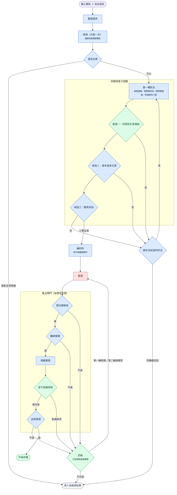

# Spider Forge

給一個新聞網站的網址，產出一支能跑的 Scrapy 爬蟲。

本專案的重點不是「讓模型寫爬蟲」。重點是**產碼前的證據驗證**與**產碼後的閘門**。
先用探測到的證據限縮模型能猜的範圍。產碼後用五道閘門逐一擋。失敗時帶著具體錯誤重寫。

模型只出現在四個地方：挑文章連結、產碼、修碼、主題判定。其餘全是程式。

---

## 為什麼需要驗證鏈

自動產爬蟲的失敗通常不是「語法錯」，而是這些：

| 失敗 | 為什麼模型看不出來 |
|---|---|
| 把導覽列當成文章連結 | 它只拿到兩個網址，不知道那是廣告或導覽 |
| 抽取規則只對第一種版型有效 | 樣本裡只有一種版型 |
| 抓到的是挑戰頁不是內文 | 挑戰頁也回 200，也有標題 |
| 翻頁參數被站方忽略 | `?page=999` 回第一頁，看起來一切正常 |
| 日期沒有時區 | 模型不知道下游要拿它排序 |


## 架構



<sub>藍＝程式判斷　綠＝程式加模型　紅＝產碼模型（唯一的金錢成本）</sub>

設計原則只有一條：**凡是有確定答案的判斷，一律用程式做**。
模型只負責需要生成或語意的部分。程式的判斷可重複、可測試、不花錢。

---

### 每一關用什麼方法

| 關卡 | 方法 | 為什麼 |
|---|---|---|
| 探測 | 程式 | 連線與瀏覽器各抓一次，記下前端呼叫 |
| 進不進得去 | 程式 | 狀態碼與證據數量是事實，不是判斷 |
| 選抓法 | 程式 | 由便宜到貴的固定順序，不問模型 |
| 找文章連結 | 程式 ＋ 模型 | 排除導覽是結構事實；分辨標題與分類名要語意 |
| 樣本驗證 | 程式 | 兩篇內容雷同就是拿到列表頁，比對即可 |
| 翻頁驗證 | 程式 | 第二頁有沒有新文章是事實 |
| 產碼／修碼 | 模型 | 唯一真正需要生成能力的地方 |
| 語法樹檢查 | 程式 | 契約違反是靜態可判的 |
| 離線重播 | 程式 | 用保存的頁面跑抽取，不連網、可重複 |
| 品質驗證 | 程式 | 數量、去重、時效都算得出來 |
| 診斷 | 程式為主 | 已知失敗樣態直接歸類，未知才問模型 |


---

## 幾個設計決定

### 失敗要分類，不能只說「失敗」

診斷會先比對已知的失敗樣態（契約違反、抽取不到、被擋、時效不符），對得上就直接歸類，
對不上才問模型。分類決定路由：可修的進修復迴圈，不可修的直接寫待處理紀錄。

被 401 擋在門外和「這個入口真的沒有文章」是完全不同的兩件事，前者要換入口或取得授權，
後者多半是網址給錯——分類含糊會讓人查錯方向。

### 修復迴圈修的是程式碼，不是證據

這是實際踩過的坑。某次抓 BBC，明細樣本抓成了導覽頁，模型照著錯的樣本學抽取規則，
兩輪修復都失敗——因為修復用的是同一份錯誤證據。診斷還把它歸成「抽取規則錯」，
方向完全反了。

所以前期偵查才要改成子迴圈：證據不對就換一種抓法重來，而不是硬著頭皮往下送。

### 界線

登入資料勿碰、絕對不搞癱瘓（低速、並發固定為一、翻頁有上限）。

---

## 測試

```bash
.venv/bin/python -m pytest tests/ -q      # Windows：.venv\Scripts\python.exe
```

220 個測試，全部離線：不連網站、不呼叫模型、不消耗額度。**跑完只要兩秒**。

---

## 實測結果

17 個站，同一份流程，`--max-retries 2`：

| 站 | 結果 | 筆數 | 合格 | 去重 | 修復輪數 |
|---|---|---|---|---|---|
| 鉅亨網台股新聞 | 成功 | 5 | 5 | 5 | 1 |
| 科技新報 | 成功 | 24 | 24 | 24 | 2 |
| 公視新聞網 | 成功 | 20 | 20 | 20 | 1 |

`published_at` 全部帶時區。網址全部去重。

平均修復1~2輪成功。
這正是本專案的論點：**驗證鏈比模型的單次品質重要**。

---

## 怎麼跑

```bash
uv sync
.venv/bin/python -m pipelines.cli doctor                  # 檢查金鑰、瀏覽器、Scrapy、站台清單
.venv/bin/python -m pipelines.cli run --url "https://news.pts.org.tw/" --max-retries 0
.venv/bin/python -m pipelines.cli batch --site examples/site_queue.bbc.yaml
.venv/bin/python -m pipelines.ui                          # 展示介面，需 uv sync --extra ui
```

第一次跑建議 `--max-retries 0`。先看一次產碼的原始品質，不讓修復迴圈把問題蓋掉。

多數站台需要網址規則，用站台設定檔給。
`article_url_patterns` 決定「哪個版面算數」。這件事模型做不到。
它分得出文章與導覽，但分不出商業版與體育版。那是使用者意圖，不是網頁裡的事實。

展示介面貼一個網址就跑，逐關顯示誰在做什麼。預設只跑前期偵查，不花錢。

---

## 目錄

```text
src/spider_forge/     函式庫（會被安裝）
  nodes/              節點，一個節點一個檔
  schemas/            要抓什麼欄位——唯一來源
  shared/             節點共用的解析、驗證與品質規則
  prompts/ clients/   提示詞；瀏覽器與模型服務
  sandbox_runtime/    沙盒子程序內的離線重播引擎
pipelines/            管線與命令列（不隨套件安裝）
  pipeline.py         唯一組裝點：節點順序與所有分支
  GRAPH.md            流程圖與每個決定的實測數據
  ui.py cli.py batch.py doctor.py
tests/                220 個測試，全離線
```

依賴方向單向：`pipelines` 用 `spider_forge`，反過來不允許。有測試擋著。

**改要抓什麼欄位只改一個地方**：`schemas/outputs.py` 的 `Article`。
欄位名、必填、給模型看的規則寫在同一個定義裡。
驗證與產碼提示詞都從它生成。加一個欄位不會只有驗證那半邊生效。

每個決定的完整推理與實測數據在 [`pipelines/GRAPH.md`](pipelines/GRAPH.md)。
