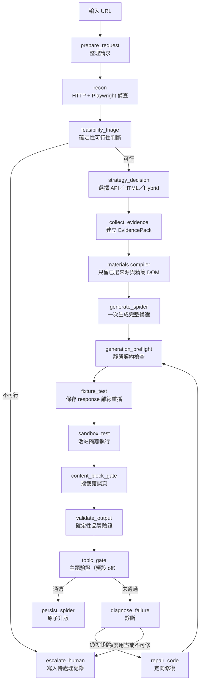

# Spider Forge

輸入網站 URL，自動偵查資料來源、生成 Scrapy 爬蟲、隔離執行、驗證品質，失敗時最多
進行兩輪定向修復。通過所有檢查的爬蟲才會升版；失敗結果寫入待人工處理紀錄。

流程會先以不呼叫模型的方式檢查可重播端點、文章資料與公開存取狀態。明確不可行時
直接停止；可行時由確定性材料編譯器只保留已選來源、精簡 DOM 與必要契約，再交給
產碼模型，避免模型猜測端點、參數或被無關材料塞滿上下文。

## 快速開始

```bash
uv sync
```

```bash
.venv/Scripts/python.exe -m pytest tests/ -q
```

```bash
.venv/Scripts/python.exe -m spider_forge run --url "https://example.com/news"
```

測試全部離線：不碰真實網站、不呼叫外部模型、不消耗 API 額度。`run` 會兩者都做。

## 模組邊界

- `pipeline.py` 是唯一流程組裝入口，負責節點順序與分支。
- `nodes/` 是節點積木庫：一個節點一個 class（`__init__` 存設定 / `__call__` 執行）。
  加新節點 = 這裡多一個檔 + `pipeline.py` 拼裝一行；節點不得互相 import（有測試鎖住）。
- `schemas/` 是資料形狀的唯一來源：`outputs.py` 定義要抓什麼欄位（pydantic `Article`），
  `llm_io.py` 是模型輸出的 schema。改抓取欄位只改這裡。
- `prompts/` 每個呼叫 LLM 的節點一個 prompt 檔，由節點注入。
- `clients/` 封裝瀏覽器與模型服務；`registry.py` 是 provider（模型/金鑰/base_url）的唯一設定點。
- `shared/` 放多個節點共同使用的解析、品質規則及領域服務。
- `sandbox_runtime/fixture_runner.py` 是離線重播引擎，只在**沙盒子程序**內以檔案路徑執行，
  只吃 JSON fixture 契約、不 import 控制層；控制層也不 import 它。
  想換成別的重播引擎：`SPIDERFORGE_FIXTURE_RUNNER=<module>`（+ `..._CWD`），遵守同一份契約即可。
- `output/` 管理候選、正式版本、歷史版本及人工回滾。
- `runs/` 管理追加式執行紀錄。
- `config.py` 是設定與執行期路徑的唯一來源。

`state.py` 把流程狀態分成三層：`ForgeInput`（呼叫端該給的）、`ForgeInternal`（節點間中間態）、
`ForgeOutput`（一次執行要交出的產出）。graph 入口只收 `ForgeInput`，`forge_result()` 只回產出。

候選爬蟲是自包含單一檔案，會在檔內定義 `ArticleItem`。本機沙盒直接以
`scrapy runspider` 執行；設 `SPIDERFORGE_CRAWLER_RUNTIME=docker` 則把程式經標準輸入送進
獨立、唯讀且無機密資料的 crawler 容器。

robots 不參與 Spider Forge 的可行性判斷、產碼契約或拒絕路由。付費牆、CAPTCHA 與
登入牆仍是不繞過的硬界線（見 `shared/request_identity.py`）。

## 流程



不可修復的失敗類別不會跑滿兩輪修復。一般產碼與第一輪修復預設使用 DeepSeek，第二輪
才升級至 Kimi。

產碼維持單次完整輸出，不採兩次生成後組裝。材料過量先由可重現的程式規則處理：
移除 script/style/svg 等雜訊、裁切 DOM、限制樣本數、排除未選 feed。

## 目錄

```text
spider_forge/                    repo 根
├── pyproject.toml               套件定義（src layout）+ uv.lock
├── src/spider_forge/            ① 函式庫本身
│   ├── nodes/                   ★ 節點積木庫（17 個節點，一節點一檔）
│   ├── schemas/                 資料形狀（outputs.py / llm_io.py）
│   ├── prompts/                 各節點的 prompt
│   ├── clients/                 browser / coder / judge / page / topic + registry + env
│   ├── shared/                  節點共用 helper 與領域服務
│   ├── sandbox_runtime/         沙盒子程序內執行的離線重播引擎
│   ├── output/  runs/  tools/
│   ├── pipeline.py              ② 管線：把積木拼成流程
│   ├── cli.py  __main__.py  config.py  state.py
├── tests/                       ③ 測試（含 manual/ 人工逐關工具）
├── examples/                    站台清單範例
└── runtime/                     執行期產物（gitignored）
```

執行期資料不放在原始碼目錄，預設在 repo 根的 `runtime/`，可用 `SPIDERFORGE_DATA_DIR` 改：

```text
runtime/
├── requests/
├── runs/<run_id>/
├── artifacts/{candidates,active,versions}/
├── records/{runs.jsonl,promotions.jsonl,dead_letter/}
└── models/
```

## 設定

金鑰放 `.env`（見 `.env.example`）或作業系統環境變數：

| 變數 | 用途 |
|---|---|
| `DEEPSEEK_API` | 初次產碼與一般修復 |
| `KIMI_API` | 只有進入最後一輪 Kimi 修復時才需要 |
| `LLM_API_KEY` | Gemini（主題閘門、內容真偽確認）|
| `OLLAMA_HOST` | 選用；預設 `http://localhost:11434` |

常用行為開關（全部可省略）：

| 變數 | 預設 | 說明 |
|---|---|---|
| `SPIDERFORGE_SITE_QUEUE` | `examples/site_queue.taiwan-finance.yaml` | 批次要跑的站台清單 |
| `SPIDERFORGE_DATA_DIR` | `<repo>/runtime` | 執行期產物根目錄 |
| `SPIDERFORGE_TOPIC_MODE` | `off` | 主題閘門：off / shadow / enforce |
| `SPIDERFORGE_GENERATION_PROVIDER` | `deepseek` | 產碼供應商 |
| `SPIDERFORGE_REPAIR_PROVIDER` | `deepseek` | 第一輪修復供應商 |
| `SPIDERFORGE_FINAL_REPAIR_PROVIDER` | `kimi` | 最後一輪修復供應商 |
| `SPIDERFORGE_CRAWLER_RUNTIME` | `local` | 沙盒執行方式：local / docker |
| `SPIDERFORGE_FIXTURE_RUNNER` | 內建 | 換掉離線重播引擎 |
| `SPIDERFORGE_USER_AGENT` / `_ACCEPT_LANGUAGE` / `_REQUEST_PURPOSE` | 見 `request_identity.py` | 請求身分（單一固定，不輪替）|

## 執行

```bash
.venv/Scripts/python.exe -m spider_forge run --url "https://example.com/news" --max-retries 0
```

```bash
.venv/Scripts/python.exe -m spider_forge batch
```

```bash
.venv/Scripts/python.exe -m spider_forge status
```

`run` 可重複 `--url`，或用 `--file` 給每行一個 URL 的檔案；`batch` 後面接
`source_prefix` 只跑指定來源；`paths` 只印資料位置。

當函式庫用：

```python
from spider_forge import forge_spider

result = forge_spider("https://example.com/news", max_retries=0)
print(result["status"], result.get("spider_path"))
```

### 逐關人工審查

`tests/manual/run_one_stage.py` 一次只跑一關，輸入是前一關的完整狀態 JSON，
刻意沒有「一次跑完」模式：

```bash
.venv/Scripts/python.exe tests/manual/run_one_stage.py prepare --input tests/manual/rba_request.json --output runtime/manual/01_prepare.json
```

`recon`、`evidence` 會接觸真實網站，`strategy` 可能使用 Ollama，`generate` 會使用
DeepSeek；`preflight` 與 `fixture` 是離線檢查。

## 證據與執行指標

`EvidencePack.replay_exchange` 保存已遮密的請求（method/URL/headers/body）與
回應（狀態碼/headers/body 樣本/是否截斷）。批次執行把每次 EvidencePack 寫入
`runs/<run_id>/evidence.json`，並在 `records/runs.jsonl` 記錄 `first_pass_success`、
`repair_count`、`coder_tokens`。

```bash
.venv/Scripts/python.exe -m spider_forge.runs.ledger
```

`first_pass_rate` 的分母是各來源最後一次執行的總站數，不只計算最後成功的站，避免把
失敗站排除後高估首次成功率。離線驗收只能證明指標與流程正確；真實站點的改善幅度仍須
用同一批站點在改造前後各跑一次才能成立。

## 外部服務

- Playwright：網站與網路請求偵查。
- Ollama：本機策略判斷與診斷，透過 HTTP。
- DeepSeek／Kimi：程式生成與修復。
- Gemini：主題判定與內容真偽確認（主題閘門預設 off）。

重構進度與設計決策見 [`REFACTOR_PLAN.md`](REFACTOR_PLAN.md)。
