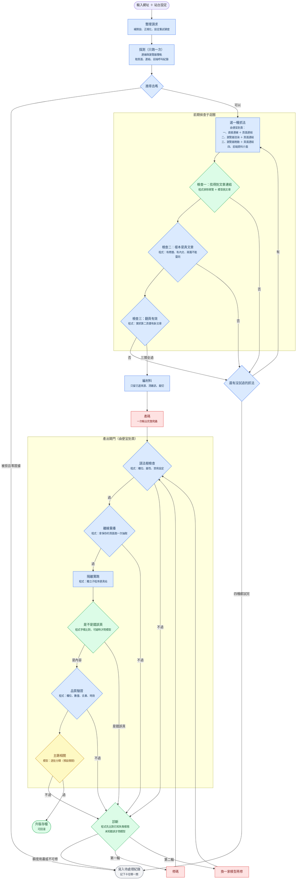

# Spider Forge

給一個新聞網站的網址，產出一支能跑的 Scrapy 爬蟲。

不是「讓大型語言模型寫爬蟲」，本專案的重點前期偵查與**產出之後的驗證鏈**：先用探測到的真實證據限縮模型
能猜的範圍，產碼後用五道由便宜到貴的閘門逐一擋，失敗時帶著具體錯誤重寫，
兩輪修不好就寫進待處理紀錄並記下卡在哪一關。

模型只出現在四個地方：挑文章連結、產碼、修碼、主題判定。其餘全是程式。

---

## 為什麼需要驗證鏈

自動產爬蟲的失敗通常不是「語法錯」，而是這些：

| 失敗 | 為什麼模型看不出來 |
|---|---|
| 把導覽列當成文章連結 | 它只拿到兩個網址，不知道那是廣告或導覽 |
| 抽取規則只對第一種版型有效 | 樣本裡只有一種版型 |
| 抓到的是挑戰頁不是內文 | 挑戰頁也回 200，也有標題 |
| 翻頁參數被站方忽略 | `?page=999` 回第一頁，看起來一切正常 |
| 日期沒有時區 | 模型不知道下游要拿它排序 |

這些都不是靠更好的提示詞能解決的——**要有東西去對照**。所以流程的設計原則是：
凡是有確定答案的判斷，一律用程式做；模型只負責真正需要生成或語意的部分。

---

## 架構



<sub>藍＝程式判斷　綠＝程式加模型　黃＝雲端模型　紅＝產碼模型（唯一的金錢成本）</sub>

### 每一關用什麼方法

| 關卡 | 方法 | 為什麼 |
|---|---|---|
| 探測 | 程式 | 連線與瀏覽器各抓一次，記下前端呼叫 |
| 進不進得去 | 程式 | 狀態碼與證據數量是事實，不是判斷 |
| 選抓法 | 程式 | 由便宜到貴的固定順序，不問模型 |
| 找文章連結 | 程式 ＋ 模型 | 排除導覽是結構事實；分辨標題與分類名要語意 |
| 樣本驗證 | 程式 | 兩篇內容雷同就是拿到列表頁，比對即可 |
| 翻頁驗證 | 程式 | 第二頁有沒有新文章是事實 |
| 產碼／修碼 | 模型 | 唯一真正需要生成能力的地方 |
| 語法樹檢查 | 程式 | 契約違反是靜態可判的 |
| 離線重播 | 程式 | 用保存的頁面跑抽取，不連網、可重複 |
| 品質驗證 | 程式 | 數量、去重、時效都算得出來 |
| 診斷 | 程式為主 | 已知失敗樣態直接歸類，未知才問模型 |

完整版與各節點的設計理由見 [`pipelines/GRAPH.md`](pipelines/GRAPH.md)。

---

## 幾個設計決定

### 閘門的順序是照成本排的

語法樹檢查不花錢也不連網，所以放第一個；離線重播用探測時保存的頁面，同樣不連網；
真正連站的隔離實跑放到第三個。一支寫壞的爬蟲在第一關就被擋下，不會浪費一次真實抓取。

### 失敗要分類，不能只說「失敗」

診斷會先比對已知的失敗樣態（契約違反、抽取不到、被擋、時效不符），對得上就直接歸類，
對不上才問模型。分類決定路由：可修的進修復迴圈，不可修的直接寫待處理紀錄。

被 401 擋在門外和「這個入口真的沒有文章」是完全不同的兩件事，前者要換入口或取得授權，
後者多半是網址給錯——分類含糊會讓人查錯方向。

### 修復迴圈修的是程式碼，不是證據

這是實際踩過的坑。某次抓 BBC，明細樣本抓成了導覽頁，模型照著錯的樣本學抽取規則，
兩輪修復都失敗——因為修復用的是同一份錯誤證據。診斷還把它歸成「抽取規則錯」，
方向完全反了。

所以前期偵查才要改成子迴圈：證據不對就換一種抓法重來，而不是硬著頭皮往下送。

### 界線只有兩條

登入資料勿碰、絕對不搞癱瘓（低速、並發固定為一、翻頁有上限）。

其餘都是預設值不是禁令。專案早期有一批「被擋一次就放棄」的規則——挑戰頁字樣直接
判死、瀏覽器看得到但直接連線看不到就放棄、無條件禁用瀏覽器互動介面——後來全部移除，
因為它們既不屬於那兩條，又實質壓低了成功率。最後一條還連帶擋死了捲動載入，
而那是現代網站最主流的翻頁形式。

---

## 目錄

```text
spider_forge/
├── src/spider_forge/        函式庫（會被安裝）
│   ├── nodes/               節點積木，一個節點一個檔
│   ├── schemas/             要抓什麼欄位——唯一來源
│   ├── prompts/             各節點的提示詞
│   ├── clients/             瀏覽器與模型服務
│   ├── shared/              節點共用的解析與品質規則
│   ├── sandbox_runtime/     沙盒子程序內的離線重播引擎
│   ├── observability/       追蹤（沒設定就完全不啟用）
│   └── config.py  state.py
├── pipelines/               管線與命令列（不隨套件安裝）
│   ├── pipeline.py          唯一組裝點：節點順序與所有分支
│   ├── GRAPH.md             架構圖，跟著這裡的程式走
│   └── batch.py  cli.py  doctor.py  profiles.py
├── tests/                   170 個測試，全離線
├── Phoenix/                 觀測服務
└── examples/                站台設定範例
```

依賴方向單向：`pipelines` 用 `spider_forge`，反過來不允許（有測試擋著）。
函式庫不含管線，就像 PyTorch 不含你的訓練腳本。

**改要抓什麼欄位只改一個地方**：`schemas/outputs.py` 的 `Article`。欄位名、必填、
給模型看的規則都寫在同一個定義裡，驗證與產碼提示詞都從它生成——加一個欄位不會
只有驗證那半邊生效。

---

## 跑起來

```bash
uv sync
```

```bash
.venv/Scripts/python.exe -m pipelines.cli doctor
```

`doctor` 檢查金鑰、瀏覽器、Scrapy、本地模型、觀測服務、站台清單、產物目錄可寫。
不呼叫外部 API，也不驗證金鑰有效性——只看該有的東西在不在。

```bash
.venv/Scripts/python.exe -m pipelines.cli run --url "https://example.com/news" --max-retries 0
```

第一次跑建議 `--max-retries 0`，先看一次生成的原始品質，不讓修復迴圈把問題蓋掉。

需要網址規則的站（大多數）用站台設定檔：

```bash
.venv/Scripts/python.exe -m pipelines.cli batch --site examples/site_queue.bbc.yaml
```

站台設定裡的 `article_url_patterns` 決定「哪個版面算數」。這件事模型做不到——
它分得出文章與導覽，但分不出商業版與體育版，那是使用者意圖不是網頁裡的事實。

---

## 測試

```bash
.venv/Scripts/python.exe -m pytest tests/ -q
```

170 個測試，全部離線：不連網站、不呼叫模型、不消耗額度。測試會把產物寫到暫存目錄，
不碰真實的執行紀錄。

幾個值得一提的：

- **架構不變式**——函式庫不得引用管線層、節點不得互相引用、命令列不得跳過組裝點直接
  用節點。這些違反在本機都能跑，只有別人安裝時才爆，所以用測試釘死。
- **提示詞與資料定義的一致性**——欄位定義改了而提示詞沒改，模型會照舊欄位產碼且
  毫無錯誤提示。測試比對兩邊，不一致就紅。
- **反向案例**——例如「翻頁的第二頁回了第一頁的內容」，前兩個檢查都會通過，
  只有比對內容擋得住。這種情境有獨立測試。

---

## 觀測

```bash
docker compose -f Phoenix/compose.yaml up -d
```

在 `.env` 設 `PHOENIX_COLLECTOR_ENDPOINT` 之後，每個節點一個 span（耗時、進出狀態、
例外堆疊），每次模型呼叫一個子 span（供應商、模型、提示詞、回覆、token 數、重試次數）。
沒設這個變數時完全不啟用，連套件都不會載入。

節點層的 span 由 OpenTelemetry 的 LangChain 儀器自動產生，節點程式碼一行都不用改——
所以「加新節點」仍然只要新增一個檔案。模型呼叫是自己用 HTTP 打的，儀器抓不到，
那部分手動包。

這在除錯時救過場：某次產碼失敗，候選程式碼因為沒過第一關而從未落檔，只剩三個錯誤
代碼，是從追蹤裡撈出完整程式碼才看出模型漏了什麼。之後改成產碼當下就落檔。

---

## 目前狀態

已實作：探測、可行性分流、找文章連結（三層過濾）、翻頁偵測與驗證、產碼、五道閘門、
診斷與修復迴圈、待處理紀錄、批次執行、觀測。

未實作：前期偵查的子迴圈（抓法升級與樣本驗證）、捲動載入的偵測。圖上標了。

進度與每個決定的理由在 [`pipelines/GRAPH.md`](pipelines/GRAPH.md)。
