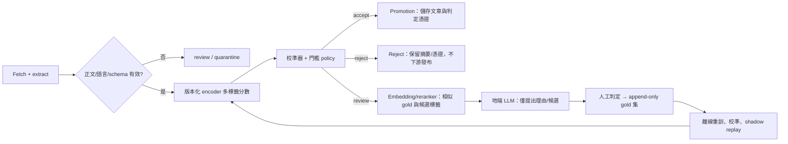

# Spider Forge：新聞財經／政策主題品質閘門研究

研究日期：2026-07-27（以 2026-07 可查資料為界）  
範圍：判定單篇爬得新聞是否「屬於財經或政策」，供 crawler graph 的品質閘門使用；要求可校準、可重播、fail-closed。  
來源限制：僅論文原文、官方 taxonomy、官方模型／專案文件。本文件將「來源所述」與「本研究設計推論」分開。

## 先給決策

**建議採混合架構：版本化 taxonomy + 小型 encoder 監督式多標籤分類器作唯一 promotion gate + 校準後的三態決策（accept / reject / review），embedding／cross-encoder 只作候選與輔助特徵；小型地端 LLM 只能處理 review queue、產生可審核建議，絕不可直接 promotion。**

這不是「LLM 比不比公版強」的二選一：公版 taxonomy 可重用，決策邊界、門檻與例外集必須由本站黃金集校準。沒有在本站分布上量得的 false-positive／false-negative／abstain 曲線，任何「模型已可用」皆為 **UNVERIFIED**。

### 立場後置：前三個失敗條件與改判證據

| 預登記失敗條件 | 會如何推翻推薦 | 改判的可觀測證據 |
|---|---|---|
| 監督式 encoder 無法在目標低誤收率下維持足夠涵蓋率 | 改採「LLM review + 人工」為主要判定，仍不讓 LLM 自動 promotion | 固定保留測試集上，全部可選門檻皆無法同時達到預設 precision / coverage SLO |
| LLM review 與人工在關鍵邊界（公司行銷、犯罪／選舉的經濟外溢）一致性不足 | 移除 LLM review；只保留人工或擴充標註後再訓練 | 按分層錯誤桶量得 LLM 對金標的 precision 或一致性低於現有 encoder |
| taxonomy 的「財經／政策」定義無法讓標註者穩定一致 | 先縮窄 scope、重寫定義／例子，暫不投入模型優化 | 雙人獨立標註的 agreement 未達預先設定門檻，且爭議集中於同一條目 |

## 問題應如何定義

### 結論

- **VERIFIED**：IPTC Media Topics 是新聞文本主題的受控 vocabulary；2026-07-09 的官方快照有分層概念與穩定的 QCode。官方說明其約 1,200+ 個術語、最深五層，並至少每年更新。這很適合當「可版本化的上位公版」，不應把關鍵詞表當 taxonomy。  
  來源：[IPTC Media Topics（官方，頁面快照 2026-07-09）](https://www.iptc.org/std/NewsCodes/treeview/mediatopic/mediatopic-en-US.html)；[IPTC Media Topics 說明（官方，發布日未標示）](https://iptc.org/standards/media-topics/)；[NewsCodes Guidelines（官方，2022）](https://www.iptc.org/std/NewsCodes/guidelines/)。
- **VERIFIED**：階層多標籤分類（HMTC）本來就是「每篇文件對預定 hierarchy 指派一組 labels」的問題；只用類名也可先以 textual-entailment 產生高信心 core labels 再自訓練，代表新 taxonomy 的冷啟動可做，但並不等於 production 品質已獲保證。  
  來源：[TaxoClass（NAACL，2021-06）](https://aclanthology.org/2021.naacl-main.335/)。
- **設計推論（UNVERIFIED，待本站資料驗證）**：Spider Forge 首層只需固定的雙軸輸出，不需一開始完整重建 1,200 個 IPTC 細類：`topic.finance` 與 `topic.public_policy` 可各為 true/false/unknown，並可附 0..n 個 IPTC leaf labels。政策不等於政治；「選舉／犯罪／娛樂」若沒有明確的公部門規範、財政／貨幣、產業規則或宏觀經濟影響，預設不是本 gate 的正類。

### 建議的可審計 schema

```json
{
  "schema_version": "topic-gate/v1",
  "taxonomy_version": "iptc-mediatopic/2026-07-09+local-v1",
  "labels": ["finance", "public_policy"],
  "decision": "accept|reject|review",
  "scores": {"finance": 0.00, "public_policy": 0.00},
  "calibration_version": "temp-scaling/2026-xx",
  "model_digest": "sha256:…",
  "input_digest": "sha256:…",
  "feature_version": "title+lede+body/v3",
  "reason_codes": ["score_above_accept_threshold"],
  "observed_at": "ISO-8601"
}
```

保留 model／taxonomy／calibration／輸入 digest 與門檻，才可把同一輸入重播為同一結果。若解析正文失敗、語言偵測不在支援集合、模型／校準版本不存在或輸出 schema 驗證失敗，一律 `review`（若人工佇列不可用則不 promotion）。這是 fail-closed 的**設計規則**，非任何來源保證。

## 方法證據與適用位置

| 方法 | 可確認的一手證據 | 對本 gate 的解讀 | 不可聲稱的事 |
|---|---|---|---|
| 監督式小型分類器 | SetFit 以 sentence-transformer contrastive fine-tune 後接 classifier head；作者報告在少樣本設定可比 PEFT/PET 少量級參數且訓練更快。來源：[論文（2022-09-22）](https://arxiv.org/abs/2209.11055) | 有首批金標後，優先作高速、固定輸出、易校準的 production gate baseline。 | 「少樣本一定足夠」：**UNVERIFIED**；須以本站語言、來源與邊界例評估。 |
| zero-shot NLI | NLI entailment 可作 zero-shot text classification 的 benchmarking 方法。來源：[Yin et al.（2019-09）](https://arxiv.org/abs/1909.00161) | 適合作冷啟動標註建議、taxonomy draft 或 baseline。 | 不可直接把 zero-shot score 當 calibrated probability 或 promotion 依據。 |
| embedding bi-encoder | BGE-M3 是多語、多功能、多粒度 embedding；官方 BGE 另將 embedding 與 reranker 區分。來源：[BGE-M3 論文（2024-02-05）](https://arxiv.org/abs/2402.03216) | 用向量取回最相近的 gold exemplars／taxonomy node，或作 classifier 特徵；易快取、可離線。 | 單一 cosine 門檻不能自然等價於「是否財經／政策」。 |
| cross-encoder reranker | 官方 BGE 說 cross-encoder 對 query 和 text 聯合編碼，直接產生相似分數；建議先 embedding 取回再 rerank。來源：[官方文件（發布日未標示，2026-07-27 存取）](https://bge-model.com/Introduction/reranker.html) | 只 rerank 少量「文件–label definition／prototype」候選，可作邊界例輔助特徵或 review 排序。 | 不能假定其分數跨 label、跨版本可校準。 |
| LLM-as-judge | 實證研究發現 fine-tuned judge 在 in-domain 可高分，但跨 generalizability、fairness、aspect-specific、scalability 不如 GPT-4；並指出這類 judge 本質上是 task-specific classifier。來源：[Huang et al.（2024-03-05）](https://arxiv.org/abs/2403.02839) | 小型地端 LLM 可產出結構化「候選標籤＋證據片段＋不確定原因」，適合 review queue。 | 不可因 prompt 看起來合理，就讓 LLM 自行決定 promotion。 |
| 信心校準 | 現代神經網路常不校準；temperature scaling 是一參數後處理，在作者實驗中有效。來源：[Guo et al.（2017-06-14）](https://arxiv.org/abs/1706.04599) | 只在獨立 validation set 擬合 temperature；用 calibrated score 來訂 accept/reject/review 門檻。 | 校準不會修正 taxonomy 漏洞、分布漂移或錯誤標註。 |
| abstain／selective classification | 可透過 reject option 在 coverage 與錯誤風險間交易，並設定目標風險；不同方法沒有單一贏家。來源：[Geifman & El-Yaniv（2017-05-23）](https://arxiv.org/abs/1705.08500)；[Pugnana et al. benchmark（2024-01-23）](https://arxiv.org/abs/2401.12708) | 三態閘門與 coverage–risk curve 是正確評估單位，不是單一 accuracy。 | 論文的影像 benchmark 數字不可移植成新聞的風險保證。 |

## 小型地端 LLM：可行，但位置受限

- **VERIFIED**：Qwen3 技術報告列出 0.6B 至 235B 的模型範圍，並主張可依查詢動態切換思考／非思考模式。來源：[Qwen3 Technical Report（2025-05-14）](https://arxiv.org/abs/2505.09388)。
- **VERIFIED**：Gemma 3 技術報告在長 context 特別設計以降低 KV cache 記憶體，官方定位為可於單張 GPU/TPU 執行的開放模型系列。來源：[Gemma 3 Technical Report（2025-03-25）](https://arxiv.org/abs/2503.19786)；[Google 官方頁（發布日未標示）](https://deepmind.google/models/gemma/gemma-3/)。
- **UNVERIFIED**：任何特定 GPU、量化格式、中文吞吐量、每篇毫秒數，未查到可直接套用 Spider Forge 內容長度與硬體的一手實測；不得預填成本／延遲。應在最小實驗量測 p50/p95、tokens/article、RAM/VRAM、失敗率與每千篇成本。
- **設計推論**：即使模型可本地跑，生成式輸出仍涉及 decode、prompt／模型版本與格式驗證；對大量爬蟲的 first-pass gate，encoder 的固定長度 single-pass 更容易作批次、快取、校準與 replay。因此「地端」是資料治理優勢，不是讓 LLM 取得 promotion 權的理由。

## 候選架構

| 架構 | 內容 | 優點 | 主要失敗條件 | 結論 |
|---|---|---|---|---|
| A. 通用 zero-shot / embedding gate | taxonomy 定義與 exemplars → NLI 或 embedding 分數 → 固定閾值 | 無標註即可啟動、taxon 更新快 | score 未針對本站校準；隱喻、公司公關、政策外溢易誤判；無法證明低誤收 | 僅 baseline／標註助理，不可作唯一 gate |
| B. 小型地端 LLM 直接裁決 | prompt + taxonomy + JSON schema，由 LLM accept/reject | 可處理長尾語義、可自然語言解釋 | prompt/model 變動難校準；結構化輸出失敗／非決定性；吞吐與成本隨輸出長度變動；judge 跨域可靠性不足 | 不採用作 promotion gate |
| C. 監督式 encoder + 校準 abstain | 金標 → multi-label encoder head → validation temperature scaling → accept/reject/review | 固定決策函數，易批次、版本化、量 coverage–risk；可用本域錯誤回訓 | 冷啟動標註不足、漂移、長尾標籤失衡 | 最小可行 production gate |
| D. 推薦混合：C 為裁決，A／B 為輔助 | C 的 accept/reject/review 是唯一 promotion 權；embedding/reranker 供候選／相似案例，LLM 僅 review 建議；人工決定新 gold | 兼顧穩定判定與新 taxonomy／邊界例處理；LLM 不成單點失效 | gating policy 寫壞、review 壅塞、gold 集偏差；需觀測與回訓紀律 | **推薦** |

### D 的 crawler graph 整合（設計規格）



**Promotion 不得依賴 LLM**：它只能寫入 `advisory` 欄位，且 parser／timeout／OOM／schema failure 都不可走 accept fallback。唯一可接受 promotion 的 provenance 是固定模型 digest + 固定 calibration/policy 版本明確產生 `accept`。此限制是本研究的 risk-control 設計，不是引用研究的直接結論。

## 門檻、黃金集與校準作法

1. **先寫 label card，再標註。** 每個 `finance`／`public_policy` 寫 definition、include、exclude、hard-negative、語言與來源範圍；記錄 taxonomy version。IPTC 的受控 vocabulary／固定 QCode 可當上位 ID，但本 gate 的操作定義要另有 local version。  
   **VERIFIED taxonomy 事實**：IPTC NewsCodes 使用永不變的 URL-based IDs 與可縮寫 QCode。來源：[IPTC Guidelines（2022）](https://www.iptc.org/std/NewsCodes/guidelines/)。
2. **建立 append-only 黃金集。** 抽樣需按來源、語言、時間、候選分數桶與「疑似 hard negative」分層；雙人獨立標註，分歧由 adjudication 決定，永遠不覆寫原始 votes。資料切分以時間與來源隔離，避免同一稿／轉載洩漏。
3. **僅使用 validation set 校準及選門檻。** 先報 raw 與 calibrated reliability（例如 ECE / Brier）及每 label PR；temperature scaling 的適用證據見 Guo et al.，但只是一個待比較 baseline。
4. **三態 policy。** 對每標籤設定 `t_accept`、`t_reject`；中間、兩 label 互相矛盾、低內容品質或 OOD proxy 皆進 `review`。財經或政策任一 accept 才可進入業務定義的「相關」，但若兩者分數都低於 reject 則 reject；其餘 fail-closed。
5. **以誤收成本訂門檻。** 首先預登記「accept precision 下界」「最大 false-positive rate」「最低 coverage」「review 容量」。不要拿 accuracy 選模型。selective-classification 文獻也主張以 risk–coverage 觀察 reject 的代價，而非單一指標。  
   來源：[Geifman & El-Yaniv（2017-05-23）](https://arxiv.org/abs/1705.08500)。
6. **每次升版先 shadow replay。** 新模型、taxonomy、prompt、正文抽取器、閾值任一變更，對固定 holdout + 最近滑動視窗跑新舊差異；未通過預登記 SLO 不切流。這是可重播的工程規則。

## 成本、延遲、誤殺：應量什麼，而非先猜數字

| 層 | 量測單位 | 預期風險 | 上線護欄 |
|---|---|---|---|
| encoder gate | p50/p95 ms/article、batch size、CPU/GPU util、OOM、cache hit | 假陰性造成誤殺；漂移後 confidence 假高 | 隨機 audit rejects；按來源/語言監控 calibration 與 recall proxy |
| embedding/reranker | candidates/article、p95、cache hit、rerank timeout | 候選漏召回、對近義標籤偏差 | 不可蓋過 encoder accept/reject；逾時直接 review |
| LLM advisory | input/output tokens、p95、格式失敗率、human agreement、queue age | 吐字拉高延遲／成本，合理化錯誤 | 嚴格 JSON schema、max tokens、timeout、無結果即 review |
| 人工 | cases/day、adjudication rate、等待時間、relabel rate | review backlog 反而漏新聞；gold 偏差 | 容量超限時提高 `review` 優先級／縮流，不放寬 accept |

**VERIFIED**：cross-encoder 的工作方式是聯合編碼 query/text，官方建議先大量 retrieval 再僅對候選 rerank，這支持「不要全量 cross-encode」的方向。  
來源：[BGE 官方 reranker 文件（發布日未標示，2026-07-27 存取）](https://bge-model.com/bge/bge_reranker.html)。

**UNVERIFIED**：Spider Forge 的每篇成本、p95 與模型大小選擇，未查到足以取代本機 benchmark 的官方數據；不可在設計文件填寫虛構數字。

## 最小實驗（先證偽，再建置）

### 資料與切分

- 蒐集 1,000–2,000 篇已抽取正文（可先跨來源／語言分層）；先做 200 篇雙標註 pilot 檢驗 label card。數量是**起始提案，非文獻保證**。
- 最終保留測試集按時間在後、來源盡可能不重疊；不得用來選 prompt、temperature、閾值或 taxonomy wording。
- 建立 6 個必報錯誤桶：純財經、純政策、雙標、公司／市場行銷、政治但非政策、社會事件有經濟字眼；另以抽取殘缺／非目標語言作 fail-closed 測試。

### 對照組

1. **A0：IPTC label definition 的 NLI zero-shot**（無微調）。
2. **A1：embedding prototype**（每 label 的金標 exemplars，cosine/linear head）。
3. **A2：BGE-style retrieval → cross-encoder rerank**（只重排候選）。
4. **A3：小型 encoder／SetFit 類監督式 multi-label head**，做 raw 和 temperature-scaled 版本。
5. **A4：地端 4B–8B LLM JSON advisory**；只在 A3 `review` 子集評估，不進 promotion。

Qwen3 與 Gemma 3 的小型開放模型家族有官方／原始報告支持；**哪一個模型最好是未查到、必須由 A4 實測決定**。  
來源：[Qwen3（2025-05-14）](https://arxiv.org/abs/2505.09388)；[Gemma 3（2025-03-25）](https://arxiv.org/abs/2503.19786)。

### 預登記通過條件（先由產品填數字）

| Gate | 必填條件 | 未通過處置 |
|---|---|---|
| 品質 | `accept` 的每 label precision 95% CI 下界 ≥ `P_min`；誤收率 ≤ `FP_max`；每錯誤桶都有 recall | 不上線自動 promotion；擴金標／縮窄 scope |
| 拒答 | coverage ≥ `C_min` 且 review rate ≤ 人工日容量；report risk–coverage curve | 調整閾值或擴人工，不能用放寬 accept 硬湊 coverage |
| 校準 | validation 與 time-split test 都報 raw/calibrated ECE、Brier；test 不惡化超 `Δ_max` | 回退 raw policy 或重新標註／校準 |
| 重播 | 固定輸入、環境與 artifact digest 100% 同決策；JSON schema failure = 0 accept | 阻擋 release |
| 效能 | 量得 p95／每千篇成本在部署預算內，且 timeout/OOM 無 accept fallback | 降模型／改 batch／增加硬體，仍不放寬決策 |

## 目前不能知道的事

- **未查到**：Spider Forge 的硬體、每分鐘文章量、正文語言分布、人工審核容量與「誤收／誤殺」業務成本，因此不可推薦確切模型尺寸、分數門檻、p95、成本或 gold 集最終大小。
- **未查到**：地端 4B/8B LLM 在本專案新聞、繁中／雙語與指定 taxonomy 上的可靠性；Qwen／Gemma 報告只證明家族與能力／部署選項，不能替代本域評估。
- **未查到**：現有 crawler graph 的節點、事件格式與 promotion 實作；上述 Mermaid 是整合合約，不是對現有程式的描述。

## 最終建議

選 **D（監督式 encoder + 校準 abstain 為唯一 gate，embedding/reranker + 小型地端 LLM 為 advisory，人工作 gold）**。先實作 artifact/digest、三態 schema、append-only gold 與 shadow replay；模型先以 A0/A1/A3 的風險–涵蓋曲線選擇，A4 只在 review 集做盲測。只有當 A3 在預登記成本下失敗，才以量測證據升高 LLM 角色；仍不可把 promotion 交給它。
