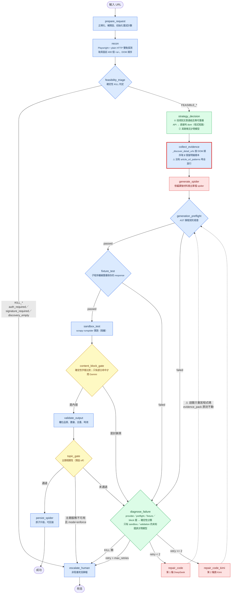
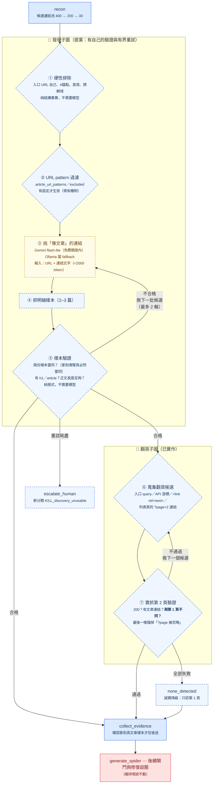
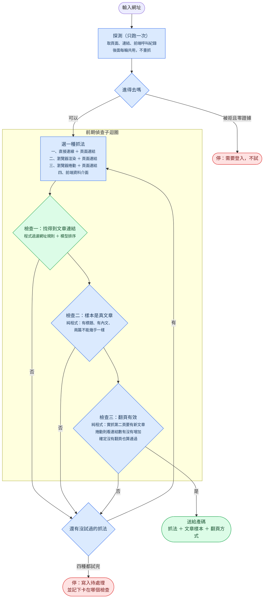
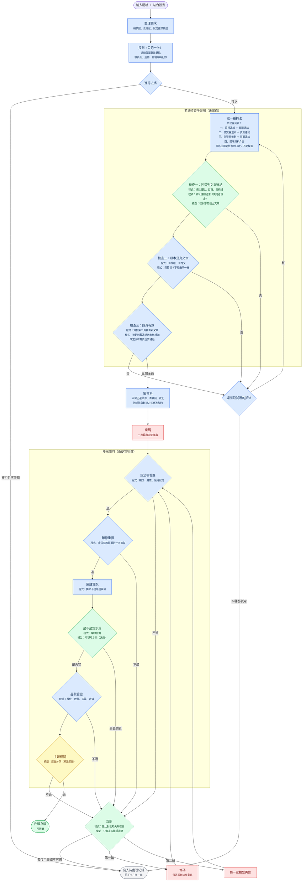

# Spider Forge 流程圖（持續更新）

這份圖跟著 `pipeline.py` 走，改流程就改這裡。用 mermaid 是為了可 diff、可版控、
GitHub 直接渲染——draw.io 的 XML 改一次要重排座標，迭代太慢。

**判斷來源的圖例**（顏色即語意，每個節點都標了）：

| 顏色 | 意思 | 成本 |
|---|---|---|
| 🟦 藍 | 程式（確定性，可寫回歸測試） | 免費 |
| 🟩 綠 | Ollama 本地模型 `qwen2.5:7b-instruct` | 免費、無配額；但要本機開著 |
| 🟨 黃 | Gemini `flash-lite` | **免費額度內**（見下方額度計算） |
| 🟥 紅 | DeepSeek／Kimi（產碼） | 付費，**唯一的實質金錢成本** |
| ⬜ 虛線 | **提案，尚未實作** | — |

### Gemini 免費額度與實際用量（2026-08-02 更新）

使用者提供：RPM 15–30 · TPM 250K–1M · RPD 1,000–1,500
**實測（2026-08-02，`gemini-3.5-flash-lite`）：RPD 上限是 500**——429 回應直接寫
`Quota exceeded for metric: generate_content_free_tier_requests, limit: 500`。
等 40 秒重試仍 429，確認是每日額度而非短窗口速率。

一次完整 run 的 Gemini 呼叫（用實際設定算，非估計）：

| 節點 | 次數 | 依據 |
|---|---|---|
| `topic_gate`（enforce） | 2 | `gemini_batch_size=20`，30 筆 → 2 批 |
| `content_block_gate` | 0–1 | 只在「部分命中封鎖字樣」且站設定 `provider=gemini` |
| 挑文章連結（提案 ③） | 1 | 30 個 URL+標題一次送完 |
| **合計** | **約 3–4** | |

→ **RPD 500 = 每天可跑 125–166 次完整 run**（原本依 1,000–1,500 算出的 250–500 要砍半）。
→ RPM 15 看似緊，但批次是序列執行、每站耗時 30–75 秒（實測 BBC 32s／Reuters 75s），
   撞不到上限。真撞到時 `clients/topic.py` 已有 `Retry-After` 退避處理。

**結論：Gemini 免費但有硬性日額度，而且會在你不知情時用完。**

先前把它標成「付費，要省」是沒查證的假設；但後來翻案成「Gemini 主力」也錯了——
額度用完是**整天不可用**，而 Ollama 沒開你可以立刻開。**對成功率而言，
Ollama 的失敗可補救，Gemini 的不行。**

所以正確定位是**機會性使用**：依序試 Gemini → Ollama → 啟發式，有額度就享受品質，
沒有就降級。這正是 `discover_links._rank()` 現在的行為，2026-08-02 實跑已驗證
（Gemini 429 → 自動退 Ollama → 流程沒中斷）。

---

## 圖一：現況（2026-08-01，對應 commit `8af87da`）



### 現況的兩個已證實缺陷

**① 發現階段沒有任何驗證**（紅框那格）。`_discover_detail_urls` 按 DOM 順序取前 2 個
連結當「文章明細樣本」。HTML 的導覽列必然排在內文之前，所以零設定跑任何新站，
拿到的都是導覽連結。BBC 實測：前 25 筆全是導覽，真文章在第 26–30 筆。

**② 修復迴圈修不了這個錯**（虛線那條）。`repair.py` 的修復 prompt 用的是
`compile_generation_materials(state["evidence_pack"])`——**同一份錯誤證據**。
模型被要求「修正 selector」，但它看到的樣本本來就不是文章。BBC 兩輪修復
都死在這裡，而診斷把它歸成 `selector_schema`（selector 錯）——**歸因是錯的**。

---

## 圖二：提案（發現階段變成有驗證的子圖）



### 為什麼這樣分三層

| 層 | 手段 | 能解決 | 不能解決 |
|---|---|---|---|
| ① 硬性排除 | 程式 | 錨點、首頁、入口自己 | 分不出「分類頁 vs 文章」 |
| ② URL pattern | 程式（使用者設定） | **哪個版面**的精確控制 | 要先知道 pattern 長什麼樣 |
| ③ 挑文章 | Gemini（Ollama fallback） | 導覽 vs 文章（新站零設定也能動） | **分不出哪個版面** |
| ⑤ 樣本驗證 | 程式 | 抓到的樣本根本不是文章 | — |

**③ 不能取代 ②。** 實測：四種啟發式與模型都會把足球新聞排進前段——它確實是
文章，只是不是商業版面的。「我要哪個版面」是使用者意圖，不是網頁裡的事實，
沒有任何模型能替你決定。

**⑤ 是這裡最便宜也最有效的一格。** BBC 那次兩份樣本的 body 都是 20000 字且高度
相似（都是同一個列表頁），純程式就抓得出來，連模型都不用呼叫。

### 模型選擇的理由（2026-08-02 翻案）

| 用在哪 | 選擇 | 為什麼 |
|---|---|---|
| ③ 第一順位 | Gemini flash-lite | 品質明顯優於 7B；**但 RPD 500 用完就整天不可用** |
| ③ 第二順位 | Ollama 本地 | 無配額、離線可用；沒開的話你可以立刻開（可補救的失敗）|
| ③ 最後兜底 | 啟發式 | 兩個模型都不可用時仍要能挑出真文章 |
| ①②⑤ | 程式 | 純結構事實，用模型是浪費且不可測 |
| — | **不用 DeepSeek** | 那是產碼模型，拿來分類是殺雞用牛刀，而且是唯一要付錢的 |

**為什麼不設「主力」而是依序嘗試**（這個判斷翻過兩次，記錄完整推理）：

1. 第一版「Ollama 主力」——理由是「Gemini 要付費」。**前提沒查證，錯了。**
2. 第二版「Gemini 主力」——理由是 Ollama 會忘記開（本次對話停過兩次）。
   **但實測發現 Gemini 有 RPD 500 的硬牆，用完整天不可用。**
3. 現在：**兩者的失敗模式不對稱**——Ollama 沒開可以立刻開，Gemini 額度用完
   只能等明天。所以不指定主力，依序嘗試並把降級原因記進 `link_discovery`，
   讓你事後看得出「那次到底是誰在挑連結」。

---

## 圖三：前期偵查子迴圈（提案）

抓法由便宜到貴逐一嘗試，三個檢查全過才往下送。



跟現況的差別：現在是一條直線，中間任何一步結果不理想都照樣往下送，問題留到
產碼之後才爆，而那時的診斷會怪錯對象。改成迴圈後，不理想就換一種抓法重來。

**探測不進迴圈**：它只跑一次把原始素材拿齊，後面每輪共用同一份，不重抓。

---

## 圖四：目標整體架構（實作依據）

前期偵查改成子迴圈之後，原本的「策略判斷」節點被吸收——不再由模型判斷該用
API 還是 HTML，而是**逐一試、驗證通過才用**。判斷失誤的成本從「產碼後才爆」
降到「當場換下一種」。



### 每一關用什麼方法

| 關卡 | 方法 | 為什麼是這個方法 |
|---|---|---|
| 整理請求 | 程式 | 純正規化，沒有判斷 |
| 探測 | 程式 | 連線與瀏覽器各抓一次，記下前端呼叫 |
| 進不進得去 | 程式 | 狀態碼與證據數量，是事實不是判斷 |
| 選抓法 | 程式 | 由便宜到貴的固定順序；偵測到前端資料介面才把它排進來 |
| 找文章連結 | 程式 ＋ 模型 | 排除導覽是結構事實（程式）；分辨標題與分類名要語意（模型） |
| 樣本驗證 | 程式 | 兩篇內容幾乎一樣就是拿到列表頁，比對即可 |
| 翻頁驗證 | 程式 | 第二頁有沒有新文章是事實 |
| 編材料 | 程式 | 可重現的裁切規則，不讓模型看無關內容 |
| 產碼 | 模型 | 唯一真正需要生成能力的一關 |
| 語法樹檢查 | 程式 | 契約違反是靜態可判的 |
| 離線重播 | 程式 | 用保存的頁面跑抽取，不連網、可重複 |
| 隔離實跑 | 程式 | 真的連站，但關在子程序裡 |
| 錯誤頁判定 | 程式為主 | 字樣比對先行；只有部分命中才問模型 |
| 品質驗證 | 程式 | 數量、去重、時效都是可算的 |
| 主題相關 | 模型 | 語意判斷，但預設關閉（通用工具不預設領域） |
| 診斷 | 程式為主 | 已知失敗樣態直接歸類；未知才問模型 |
| 修碼 | 模型 | 同產碼 |

**模型只出現在四個地方**：挑文章連結、產碼、修碼、主題判定。其餘全是程式——
可重複、可測試、不花錢。這不是節儉，是因為那些判斷本來就有確定的答案。

---

## 實作進度

- [x] **①②③ `discover_links` 節點**（commit 見變更記錄）——插在 `strategy_decision`
      與 `collect_evidence` 之間。三層過濾 + 三段 fallback（Gemini → Ollama → 啟發式）。
      用 BBC 實抓的 30 個連結鎖成回歸測試（`tests/fixtures/bbc_business_links.json`）。
- [x] **limit 2 → 3** —— 產碼模型多看一個版型（BBC 卡在 `insufficient_items` 正是
      selector 只吃到一種版型）；同時讓 `sample_urls` 填滿 2 個時，模型挑的仍有
      一個名額進得去（實測：method=gemini、model_picks_used=1）
- [x] **`verify_pagination` 節點** —— 翻頁也走「候選 → 逐一驗證 → 確定才往下放」。
      偵測不等於可用：`?page=999` 被站方忽略時會回第 1 頁，HTTP 200 ✓、有文章連結 ✓，
      只有「第 2 頁的文章與第 1 頁比對」擋得住。cursor 型無法預先實抓，放行但標
      `verified=False`，不假裝驗證過。
- [ ] ⑤ 明細樣本驗證 + 有界重試 —— 下一步
- [x] `run --site <yaml>` / `batch --site <yaml>` —— 不必再靠環境變數傳站台設定

### ③ 模型挑選的實測（2026-08-02，真實 Gemini 呼叫）

把 BBC 的 21 個候選（硬性排除後）送進 `gemini-3.5-flash-lite`：

```
1. ✓ /sport/football/articles/…  「Fifa scraps controversial World Cup…」
2. ✓ /news/articles/cr7k49xjzzeo 「AI firms must answer for rogue bots…」
3. ✓ /news/articles/c8x274xxxpwo 「India wants to join the strawberry…」
4. ✓ /news/articles/c0jl8v23qwgo 「The Chinese robot army transforming…」
5. ✓ /news/articles/c62q7w003lro 「BP puts North Sea business up for sale」
```

**精確率與召回率都是 100%**（那 30 個連結裡的真文章正好是這 5 篇，零誤判）。
但**第 1 名是足球新聞**——再次印證「模型分不出版面」，`excluded_url_patterns: ['/sport/']`
仍然是把它擋掉的唯一手段。三層分工的必要性至此有了直接證據，不再只是推論。

### ①②③ 的實測對照（BBC 真實資料，非模擬）

| | 命中真文章 | 挑到什麼 |
|---|---|---|
| 改動前（DOM 順序取 2） | **0/2** | `/business#bbc-main`、首頁 |
| 零設定 + 啟發式 fallback | 2/2 | 真文章（含體育版）|
| 有 `article_url_patterns` | 2/2 | 全是商業新聞 |

這組數字同時證明了兩件事：舊行為確實壞掉，而且**③ 取代不了 ②**——零設定時
挑到的是體育新聞，要指定版面仍然只能靠 URL pattern。

## 變更記錄

- 2026-08-02（下午）：換新 API key 後實測 Gemini 挑選 5/5 完美；limit 2→3 讓模型
  在 sample_urls 之外仍有名額。前一把 key 是被排程任務在早上 6:00 用完的。
- 2026-08-02：使用者提供 Gemini Free Tier 實際額度（RPM 15–30／RPD 1,000–1,500），
  據此翻案模型主從：③ 改為 Gemini 主力、Ollama fallback。原判斷建立在「Gemini 要
  付費」這個未查證的假設上。
- 2026-08-01：建立。圖一為現況實況（查程式碼確認每個節點的判斷來源），
  圖二為 BBC 實跑失敗後的提案。
