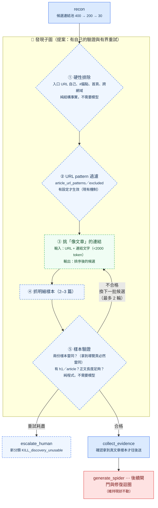

# Spider Forge 流程圖（持續更新）

這份圖跟著 `pipeline.py` 走，改流程就改這裡。用 mermaid 是為了可 diff、可版控、
GitHub 直接渲染——draw.io 的 XML 改一次要重排座標，迭代太慢。

**判斷來源的圖例**（顏色即語意，每個節點都標了）：

| 顏色 | 意思 | 成本 |
|---|---|---|
| 🟦 藍 | 程式（確定性，可寫回歸測試） | 免費 |
| 🟩 綠 | Ollama 本地模型 `qwen2.5:7b-instruct` | 免費（不吃 API 額度） |
| 🟨 黃 | Gemini | 付費，少量 |
| 🟥 紅 | DeepSeek／Kimi（產碼） | 付費，主要成本 |
| ⬜ 虛線 | **提案，尚未實作** | — |

---

## 圖一：現況（2026-08-01，對應 commit `8af87da`）

### 現況的兩個已證實缺陷

**① 發現階段沒有任何驗證**（紅框那格）。`_discover_detail_urls` 按 DOM 順序取前 2 個
連結當「文章明細樣本」。HTML 的導覽列必然排在內文之前，所以零設定跑任何新站，
拿到的都是導覽連結。BBC 實測：前 25 筆全是導覽，真文章在第 26–30 筆。

**② 修復迴圈修不了這個錯**（虛線那條）。`repair.py` 的修復 prompt 用的是
`compile_generation_materials(state["evidence_pack"])`——**同一份錯誤證據**。
模型被要求「修正 selector」，但它看到的樣本本來就不是文章。BBC 兩輪修復
都死在這裡，而診斷把它歸成 `selector_schema`（selector 錯）——**歸因是錯的**。

---

## 圖二：提案（發現階段變成有驗證的子圖）

### 為什麼這樣分三層

| 層 | 手段 | 能解決 | 不能解決 |
|---|---|---|---|
| ① 硬性排除 | 程式 | 錨點、首頁、入口自己 | 分不出「分類頁 vs 文章」 |
| ② URL pattern | 程式（使用者設定） | **哪個版面**的精確控制 | 要先知道 pattern 長什麼樣 |
| ③ 挑文章 | Ollama 本地 | 導覽 vs 文章（新站零設定也能動） | **分不出哪個版面** |
| ⑤ 樣本驗證 | 程式 | 抓到的樣本根本不是文章 | — |

**③ 不能取代 ②。** 實測：四種啟發式與模型都會把足球新聞排進前段——它確實是
文章，只是不是商業版面的。「我要哪個版面」是使用者意圖，不是網頁裡的事實，
沒有任何模型能替你決定。

**⑤ 是這裡最便宜也最有效的一格。** BBC 那次兩份樣本的 body 都是 20000 字且高度
相似（都是同一個列表頁），純程式就抓得出來，連模型都不用呼叫。

### 模型選擇的理由

| 用在哪 | 選擇 | 為什麼 |
|---|---|---|
| ③ 挑文章連結 | **Ollama 本地** | 免費、已在流程裡、任務比它現在做的「策略判斷」還簡單；下游還有五道閘門兜底 |
| ③ 的 fallback | Gemini | 本地判不出來才升級，便宜且已接好 |
| ①②⑤ | 程式 | 純結構事實，用模型是浪費且不可測 |
| — | **不用 DeepSeek** | 那是產碼模型，拿來分類是殺雞用牛刀，而且吃的是付費額度 |

---

## 待辦順序

1. **先跑通一個站拿到成功基準** —— 目前零個成功案例，任何改動都無從判斷好壞
2. 做 ⑤（樣本驗證，純程式）—— 零成本、可測試、能抓到 BBC 這類案例
3. 做 ①（硬性排除，純程式）
4. 做 ③（本地模型挑連結）—— 用步驟 1 的成功案例當回歸基準
5. `run --site <yaml>` 補 CLI 缺口（validation 目前只能從站台 YAML 進入，見
   `batch.py:run_site`；`run` 子命令組不出來）

## 變更記錄

- 2026-08-01：建立。圖一為現況實況（查程式碼確認每個節點的判斷來源），
  圖二為 BBC 實跑失敗後的提案。
